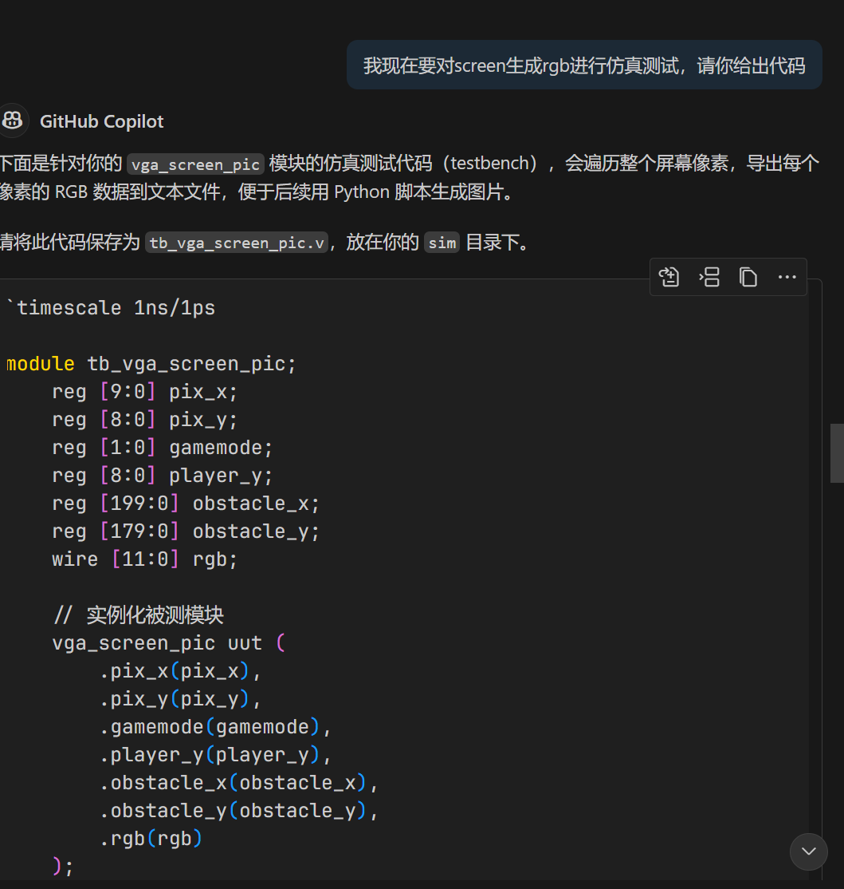
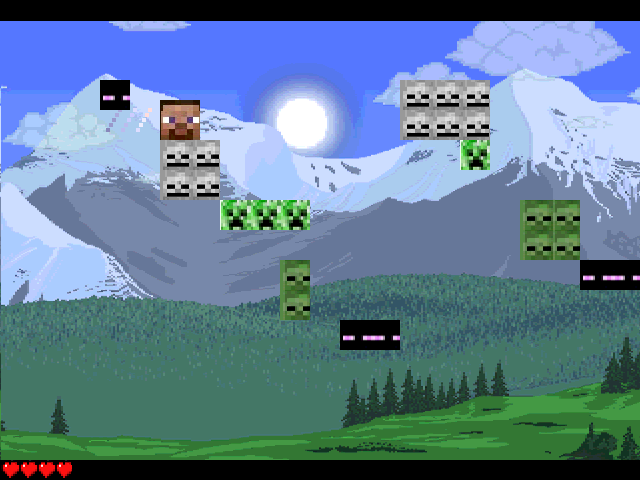
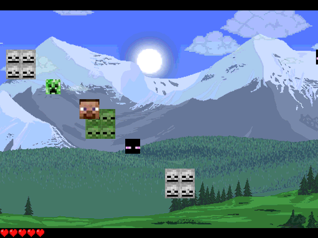

# VGA仿真帮助

本文描述如何对VGA显示模块 (本project的`vga_screen_pic.sv`) 进行仿真。

## 仿真流程

我们的目标是在不实际上板的情况下，通过仿真验证 `vga_screen_pic` 模块生成的画面是否正确。核心思路是“扫描”屏幕上的每一个像素点，记录其颜色值，最后将这些颜色值组合成一张图片。

- 以我的仿真为例，借助AI，步骤如下:
    1. 使用ai生成仿真文件
    

    ```verilog
    timescale 1ns/1ps

    module tb_vga_screen_pic;
        reg [9:0] pix_x;
        reg [8:0] pix_y;
        reg [1:0] gamemode;
        reg [8:0] player_y;
        reg [199:0] obstacle_x;
        reg [179:0] obstacle_y;
        wire [11:0] rgb;

        // 实例化被测模块
        vga_screen_pic uut (
            .pix_x(pix_x),
            .pix_y(pix_y),
            .gamemode(gamemode),
            .player_y(player_y),
            .obstacle_x(obstacle_x),
            .obstacle_y(obstacle_y),
            .rgb(rgb)
        );

        integer f;
        initial f = $fopen("screen_pixels.txt", "w");

        initial begin
            // 设置测试参数
            gamemode = 2'b01;      // 游戏进行中
            player_y = 9'd200;     // 玩家Y坐标
            obstacle_x = 200'b0;   // 障碍物全为0（可根据需要修改）
            obstacle_y = 180'b0;

            // 扫描整个屏幕像素
            for (pix_y = 0; pix_y < 480; pix_y = pix_y + 1) begin
                for (pix_x = 0; pix_x < 640; pix_x = pix_x + 1) begin
                    #1; // 等待组合逻辑稳定
                    $fwrite(f, "%d %d %h %h %h\n", pix_y, pix_x, rgb[11:8], rgb[7:4], rgb[3:0]);
                end
            end

            $fclose(f);
            $stop;
        end

    endmodule
    ```
    2. **Important**:将上面的`$fopen("screen_pixels.txt", "w");`的`screen_pixels.txt`改成改成本地文件夹下文件的一个绝对路径,如`C:/Users/simu/screen_pixels.txt`,实测发现不需要有原来的文件，仿真时会新建。
    2. 

- 具体步骤思路如下：

    1.  **编写Testbench**:创建一个专门用于测试 `vga_screen_pic` 的[仿真文件](./testbench/tb_vga.sv)（例如`tb_vga.sv`）。

    2.  **模拟像素扫描**: 在Testbench中，使用嵌套循环遍历所有像素坐标，即 `pix_y` 从 0 到 479，`pix_x` 从 0 到 639。

    3.  **提供输入**: 为 `vga_screen_pic` 模块提供必要的输入，如 `gamemode`, `player_y` 等，以模拟特定的游戏场景。

    4.  **记录像素颜色**: 对于每一个像素坐标 (`pix_x`, `pix_y`)，Testbench会记录下 `vga_screen_pic` 模块输出的 `rgb` 颜色值。

    5.  **导出数据到文件**: 使用Verilog的系统任务 (`$fopen`, `$fwrite`, `$fclose`)，将每个像素的坐标和颜色值写入一个文本文件（例如 `screen_pixels.txt`）。文件格式通常为：`行坐标 列坐标 B G R`。(注意`vga_screen_pic.sv`的写入的是`bgr`还是`rgb`,需与python代码对应)

    6.  **运行仿真**: 在Vivado等仿真工具中运行此Testbench。(注意如果默认仿真时间不足，请点击继续仿真，直到结束，这里结束时会跳转到仿真代码的`$finish`)仿真结束后，你将得到路径里的`screen_pixels.txt` 文件。

    7.  **生成图片**: 使用一个简单的Python脚本（需安装Pillow库），读取 `screen_pixels.txt` 文件。python脚本(AI生成)会创建一个640x480的空白图片，并根据文件中的数据填充每一个像素的颜色。

    ```python
    #配置python环境
    pip install pillow #也可使用conda
    ```
    ```python
    # 代码示例
    from PIL import Image

    WIDTH, HEIGHT = 640, 480
    img = Image.new("RGB", (WIDTH, HEIGHT), "black")
    pixels = img.load()
    #注意脚本和txt文件是否在同一个文件夹
    with open("screen_pixels.txt") as f:
        for line in f:
            row, col, b, g, r = line.strip().split() #注意这里的rgb还是bgr，与仿真写入的相对应
            row = int(row)
            col = int(col)
            # 4位转8位
            r = int(r, 16) * 17
            g = int(g, 16) * 17
            b = int(b, 16) * 17
            if 0 <= col < WIDTH and 0 <= row < HEIGHT:
                pixels[col, row] = (r, g, b)

    img.save("new_screen_pixels.png")
    img.show()
    print("图片已保存为 screen_pixels.png")
    ```

    8.  **验证结果**: 查看生成的图片（例如 `screen_output.png`），即可直观地判断你的 `vga_screen_pic` 模块逻辑是否正确

    

## GIF

不满足于一帧图片？可用利用多帧合成gif看到你的动态图片！



### Instruction

与前文的思路类似，但是要利用vivado的仿真文件写入多个文件，利用多帧合成gif文件，看到你的仿真结果。

1. 仿真文件[示例](./testbench/tb_vga_pic_multi.sv)(AI生成)
2. 运行仿真,同样注意仿真是否跑完，点击vivado的继续跑完仿真。
3. 利用python合成gif文件