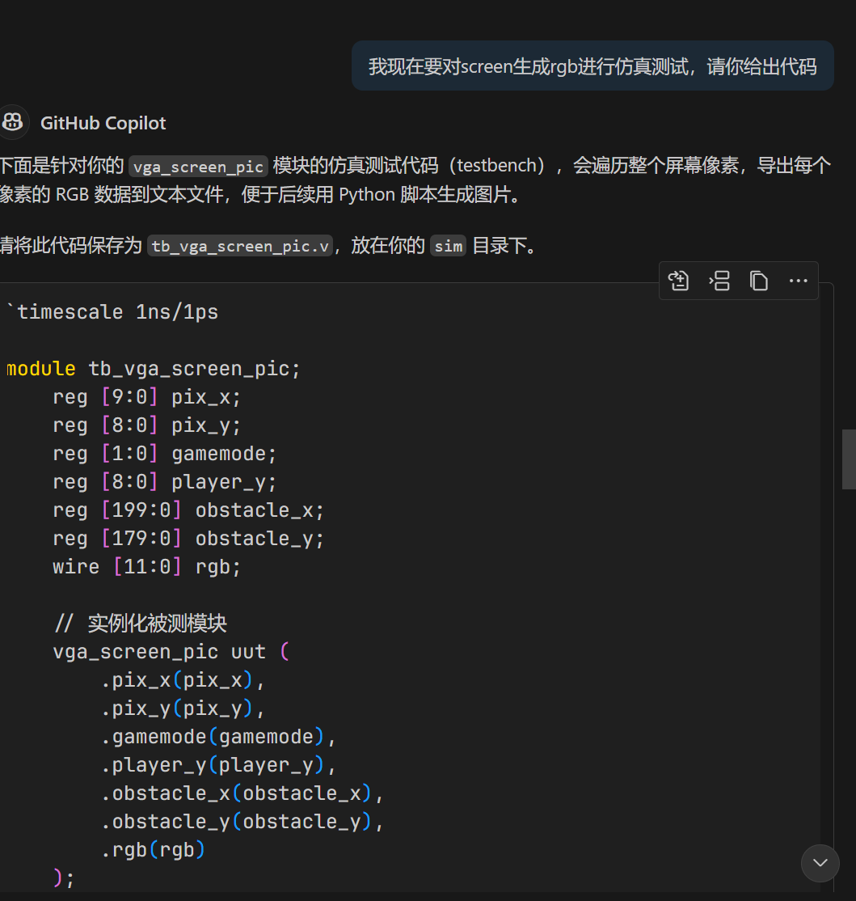
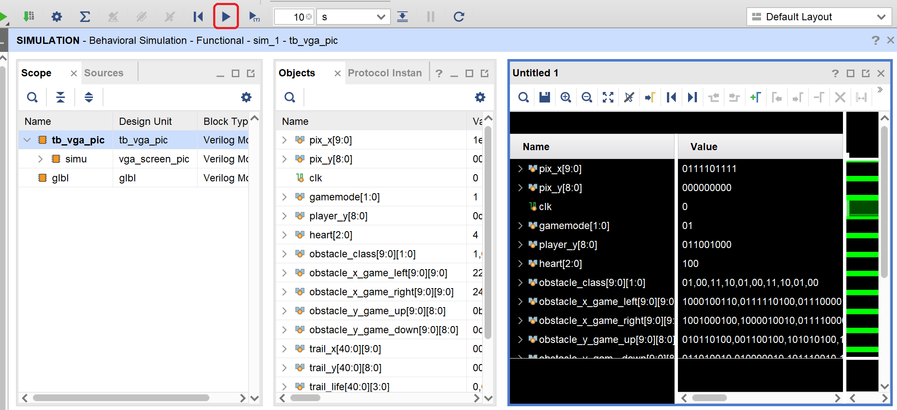
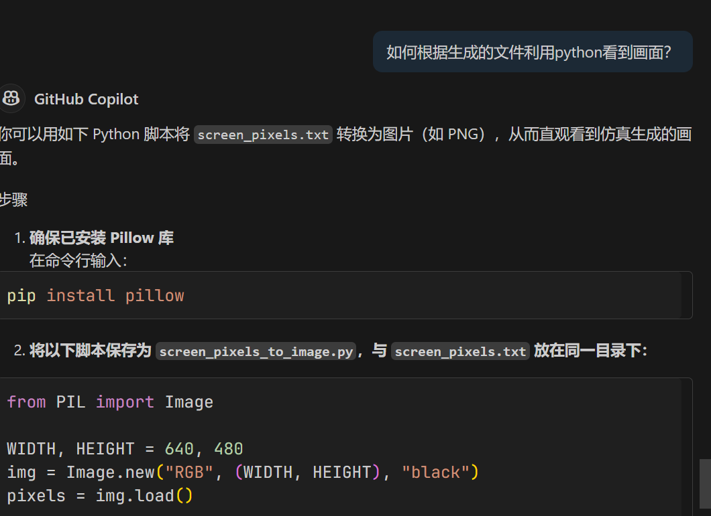
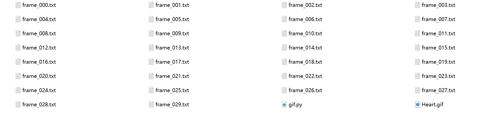
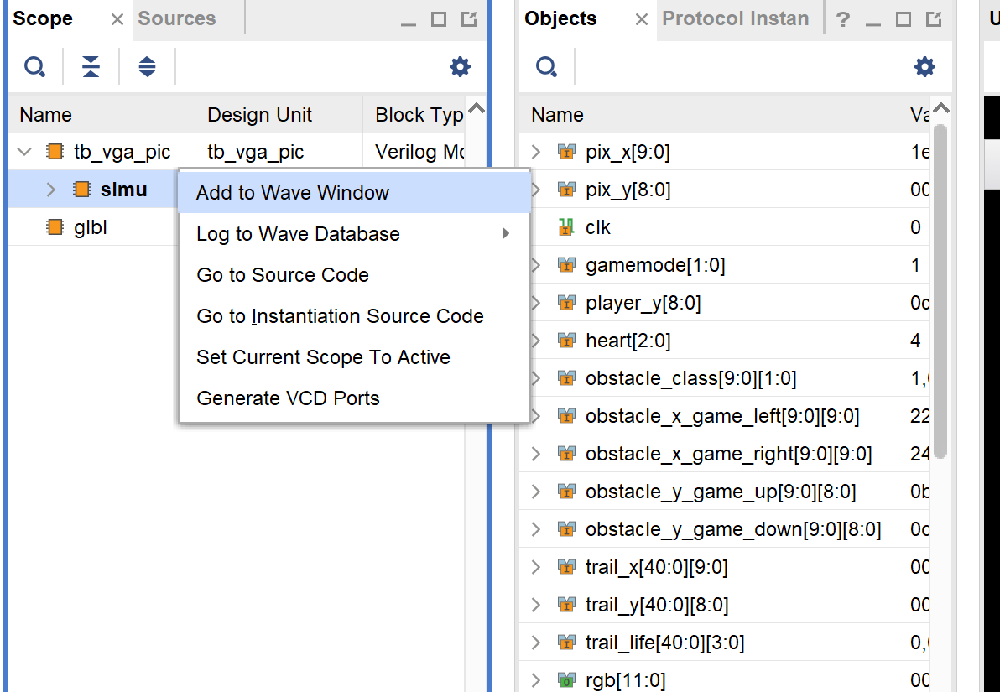

# VGA仿真帮助

本文附属于[仓库](https://github.com/tanginrattay/LCDF_project)描述如何对VGA显示模块 (本project的`vga_screen_pic.sv`) 进行仿真。

## 介绍

在使用vga显示时，常常要利用一个模块生成rgb的值，传入vga，本文正是介绍了如何对生成rgb的模块进行仿真，检验rgb生成的逻辑。

>注意：
>本文利用ai代码仅仅介绍进行仿真的思路，具体仿真请遵照ai使用规范。

## 仿真流程

我们的目标是在不实际上板的情况下，通过仿真验证 `vga_screen_pic` 模块生成的画面是否正确。核心思路是“扫描”屏幕上的每一个像素点，记录其颜色值，最后将这些颜色值利用python组合成一张图片。

### ai辅助

以ai生成的仿代码真为例，步骤如下:

1. 使用ai生成仿真文件

    

    ```verilog
    //实例化和定义接口省略
        integer f;
        initial f = $fopen("screen_pixels.txt", "w");

        initial begin
        //初始化参数省略

            for (pix_y = 0; pix_y < 480; pix_y = pix_y + 1) begin
                for (pix_x = 0; pix_x < 640; pix_x = pix_x + 1) begin
                    #1;
                    $fwrite(f, "%d %d %h %h %h\n", pix_y, pix_x, rgb[11:8], rgb[7:4], rgb[3:0]); //注意这里的rgb的高低位是rgb还是bgr
                end
            end

            $fclose(f);
            $stop;
        end

    endmodule
    ```

1. **Important**:将上面的`$fopen("screen_pixels.txt", "w");`的`screen_pixels.txt`改成改成本地文件夹下文件的一个绝对路径,如`C:/Users/simu/screen_pixels.txt`,实测发现不需要有原来的文件，仿真时会新建。(注意这里如果windows的路径是`\`,请使用`/`)
1. 使用vivado进行仿真，注意下面示例界面的继续的按钮，如果仿真没有完成(弹到仿真文件的`$stop`,请点击，继续仿真)
    
1. 在`txt`文件对应的文件夹下，让ai创建一个python文件,用于生成图片。

    

    ```bash
    #配置python环境
    pip install pillow #也可使用conda
    ```

    ```python
    from PIL import Image

    WIDTH, HEIGHT = 640, 480
    img = Image.new("RGB", (WIDTH, HEIGHT), "black")
    pixels = img.load()

    with open("screen_pixels.txt") as f:
        for line in f:
            row, col, r, g, b = line.strip().split() #注意这里的rgb还是bgr
            row = int(row)
            col = int(col)
            r = int(r, 16) * 17
            g = int(g, 16) * 17
            b = int(b, 16) * 17
            if 0 <= col < WIDTH and 0 <= row < HEIGHT:
                pixels[col, row] = (r, g, b)

    img.save("screen_output.png")
    print("图片已保存为 screen_output.png")
    ```

3. 运行python代码，查看结果，下面是一个示例结果
    

### 具体思路

1.  **编写Testbench**:创建一个专门用于测试 `vga_screen_pic` 的[仿真文件](./testbench/tb_vga.sv)（例如`tb_vga.sv`）。

2.  **模拟像素扫描**: 在Testbench中，使用嵌套循环遍历所有像素坐标，即 `pix_y` 从 0 到 479，`pix_x` 从 0 到 639。

3.  **提供输入**: 为 `vga_screen_pic` 模块提供必要的输入，如 `gamemode`, `player_y` 等，以模拟特定的游戏场景。

4.  **记录像素颜色**: 对于每一个像素坐标 (`pix_x`, `pix_y`)，Testbench会记录下 `vga_screen_pic` 模块输出的 `rgb` 颜色值。

5.  **导出数据到文件**: 使用Verilog的系统任务 (`$fopen`, `$fwrite`, `$fclose`)，将每个像素的坐标和颜色值写入一个文本文件（例如 `screen_pixels.txt`）。文件格式通常为：`行坐标 列坐标 B G R`。(注意`vga_screen_pic.sv`的写入的是`bgr`还是`rgb`,需与python代码对应)

6.  **运行仿真**: 在Vivado等仿真工具中运行此Testbench。(注意如果默认仿真时间不足，请点击继续仿真，直到结束，这里结束时会跳转到仿真代码的`$finish`)仿真结束后，你将得到路径里的`screen_pixels.txt` 文件。

7.  **生成图片**: 使用一个简单的Python脚本（需安装Pillow库），读取 `screen_pixels.txt` 文件。python脚本(AI生成)会创建一个640x480的空白图片，并根据文件中的数据填充每一个像素的颜色。

8.  **验证结果**: 查看生成的图片（例如 `screen_output.png`），即可直观地判断你的 `vga_screen_pic` 模块逻辑是否正确

## GIF

不满足于一帧图片？可用利用多帧合成gif看到你的动态图片!(此处的gif在pdf中可能无法正常显示，可以查看[仓库](https://github.com/tanginrattay/LCDF_project)中的同名md文件)


### Instruction

与前文的思路类似，但是要利用vivado的仿真文件写入多个文件，利用多帧合成gif文件，看到你的仿真结果。

1. 仿真文件示例(AI生成)

    ```verilog
    //示例
        for (int frame = 0; frame < NUM_FRAMES; frame = frame + 1) begin
        //赋值等省略
                // 2. 为当前帧生成图像文件
                filename = $sformatf("C:/Users/simu/GIF/frame_%03d.txt", frame);
                fp = $fopen(filename, "w");
                $display("Generating frame %0d -> %s", frame, filename);
                
                // 扫描整个屏幕并写入像素数据
                for (int y = 0; y < 480; y++) begin
                    for (int x = 0; x < 640; x++) begin
                        pix_x = x;
                        pix_y = y;
                        #2;
                        $fwrite(fp, "%d %d %h %h %h\n", pix_y, pix_x, rgb[11:8], rgb[7:4], rgb[3:0]);//bgr
                    end
                end
                $fclose(fp);
            end

            #10 $finish;            
    ```

1. 运行仿真,同样注意仿真是否跑完，点击vivado的继续按钮跑完仿真。

1. 利用python(AI生成)合成gif文件,最后的文件夹如下

    ```python
    #python代码示例
    import os
    import glob
    import numpy as np
    from PIL import Image

    # --- 配置参数 ---
    # 输入文件所在的目录 (请确保路径正确)
    INPUT_DIR = "C:/absolute_path"
    # 文件匹配模式
    FILE_PATTERN = "frame_*.txt"
    # 输出的GIF文件名
    OUTPUT_GIF = "Result.gif"

    # VGA屏幕尺寸
    SCREEN_WIDTH = 640
    SCREEN_HEIGHT = 480

    # GIF每帧的持续时间 (毫秒)
    FRAME_DURATION = 50  # 约等于 20 FPS


    def create_gif_from_frames():
        """
        读取所有帧文本文件，并将它们合成为一个GIF动画。
        """
        # 构造文件搜索路径
        search_path = os.path.join(INPUT_DIR, FILE_PATTERN)

        # 查找并排序所有帧文件，确保动画顺序正确
        frame_files = sorted(glob.glob(search_path))

        if not frame_files:
            print(f"错误：在目录 '{INPUT_DIR}' 中没有找到任何匹配 '{FILE_PATTERN}' 的文件。")
            print("请检查 INPUT_DIR 路径是否正确，以及仿真是否已生成了文件。")
            return

        print(f"找到了 {len(frame_files)} 个帧文件，开始处理...")

        pil_frames = []
        for i, filepath in enumerate(frame_files):
            print(f"  处理帧 {i + 1}/{len(frame_files)}: {os.path.basename(filepath)}")

            # 创建一个黑色的空白图像数组 (Height, Width, Channels)
            # 使用 uint8 类型，因为颜色值将被转换为 0-255
            image_array = np.zeros((SCREEN_HEIGHT, SCREEN_WIDTH, 3), dtype=np.uint8)

            try:
                with open(filepath, 'r') as f:
                    for line in f:
                        parts = line.strip().split()
                        if len(parts) != 5:
                            continue

                        y, x, r_hex, g_hex, b_hex = parts #这里的gbr

                        # 将坐标转换为整数
                        y, x = int(y), int(x)

                        # 将4位的十六进制颜色值 (0-15) 转换为8位的十进制颜色值 (0-255)
                        # 乘以17 (0x11) 是一个很好的映射方法，因为 0xF * 17 = 255
                        r_8bit = int(r_hex, 16) * 17
                        g_8bit = int(g_hex, 16) * 17
                        b_8bit = int(b_hex, 16) * 17

                        # 在图像数组中设置像素颜色
                        if 0 <= y < SCREEN_HEIGHT and 0 <= x < SCREEN_WIDTH:
                            image_array[y, x] = [b_8bit, g_8bit, r_8bit]

                # 从NumPy数组创建Pillow图像对象
                pil_image = Image.fromarray(image_array, 'RGB')
                pil_frames.append(pil_image)

            except Exception as e:
                print(f"处理文件 {filepath} 时出错: {e}")
                continue

        # --- 保存为GIF ---
        if pil_frames:
            print(f"\n正在保存GIF动画到 '{OUTPUT_GIF}'...")
            pil_frames[0].save(
                OUTPUT_GIF,
                save_all=True,
                append_images=pil_frames[1:],  # 将剩余的帧附加到后面
                duration=FRAME_DURATION,
                loop=0  # 0表示无限循环
            )
            print("完成！")
        else:
            print("没有成功处理任何帧，无法生成GIF。")


    if __name__ == "__main__":
        create_gif_from_frames()
    ```




## DEBUG

仿真不是目的，debug才是目的。

1. 我遇到了txt文件里的rgb是x？
Q: 再次进行仿真，在vivado的scope加入仿真模块，查看对应坐标的不定态原因，可能是一个一个input的不定态导致的输出不定态
    
    ~~我进行大程时主要是上面的debug,而且特别多~~

**Tip**：vivado波形界面改变`pix_x`或者`pix_y`是radix使用unsigned integer可以查看十进制坐标